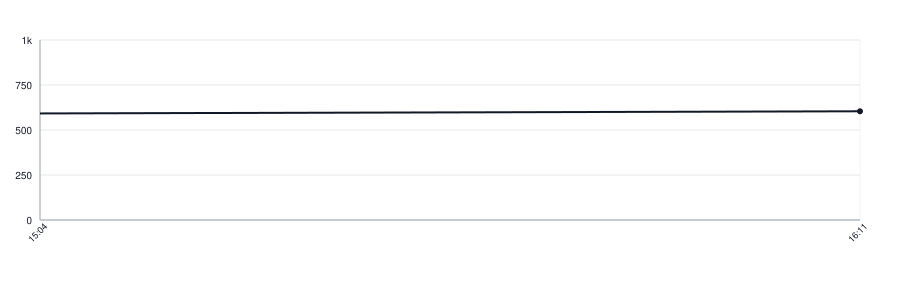

# lettermark

[](https://github.com/botforge-pro/lettermark/actions/workflows/go.yml)
[](https://pkg.go.dev/github.com/botforge-pro/lettermark)

The mark a thing gets when it has no picture of its own: the letters that go in
the square, and which of the palette's colour slots it is drawn on.

```go
letters := lettermark.Initials(name)

marks := lettermark.NewPalette(12) // however many colours your theme paints
slot := marks.Slot(id)             // 0 … marks.Slots()-1
```

The palette is not here, and neither is its size. A caller keeps its own — CSS
custom properties, a colour catalogue, a theme — and says how many colours are
in it when it builds the palette. That keeps one thing in one place: the rule
here, the colours where the rest of the design lives, the count beside them.

Build it once, with the rest of your setup. `NewPalette` refuses a count below
1, because a palette that paints nothing means the code and the theme disagree,
and the place to hear that is startup rather than the middle of a screen.

`Initials` is given the name a reader sees. A caller holding markup strips it
first; this library does not know what markup its caller writes.

`cases.yaml` is the contract. Every port carries a copy of it and a test that
compares that copy with this repository byte for byte, so a case added here is
answered by all of them or fails loudly.

## Ports

- Go — this repository, and the one the others follow
- Swift — [lettermark-swift](https://github.com/botforge-pro/lettermark-swift)
- Kotlin — [lettermark-kotlin](https://github.com/botforge-pro/lettermark-kotlin)

## Lines of Code

<picture>
  <source media="(prefers-color-scheme: dark)" srcset=".github/loc-history-dark.svg">
  <source media="(prefers-color-scheme: light)" srcset=".github/loc-history-light.svg">
  
</picture>
